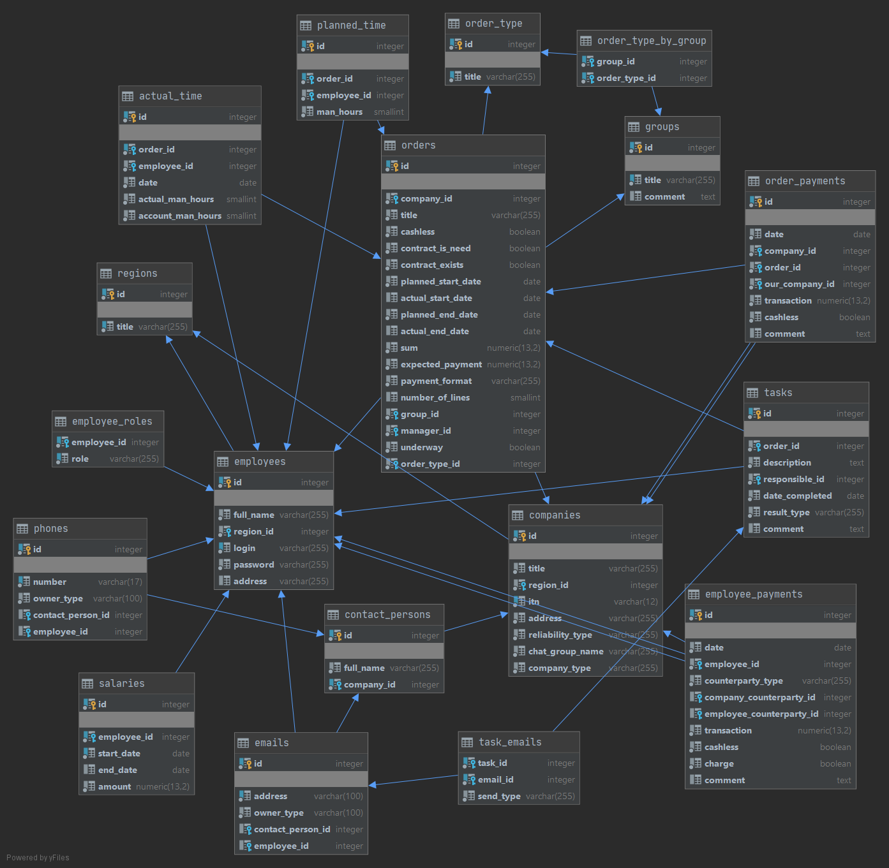

  

___

`Overseer` - is a Restful Service for managing company data.

`Specification`: [_Eng_](docs/specification_eng.md) / [_Ru_](docs/specification_eng.md)

[_API Documentation_](docs/api.md) & [_curls_](docs/curls.md)

#### *Using stack:* 

1. Java
2. Spring (Core, MVC, Security)
3. Hibernate
4. Tomcat
5. Maven
6. Jackson
7. Ehcache
8. JUnit, Hamcrest
9. PostgreSQL

#### *Database diagram:* 

